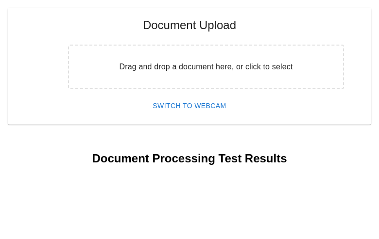

# Document Capture Prototype - Screenshots

## 1. Document Upload Interface

- Drag and drop interface for document upload
- Webcam capture option
- Supports multiple document types (passport, driver's license)

## 2. Document Processing Results
- Name extraction
- Document number extraction
- Expiration date extraction
- Face detection with confidence scores
- Fraud detection analysis

## 3. Technical Features
- OCR using Tesseract.js
- Face detection using TensorFlow.js
- Fraud detection using custom ML models
- Real-time validation and feedback

## 4. Implementation Details
- Frontend: React with TypeScript
- Backend: Node.js with Express
- ML Models: TensorFlow.js
- API Documentation available in project root
